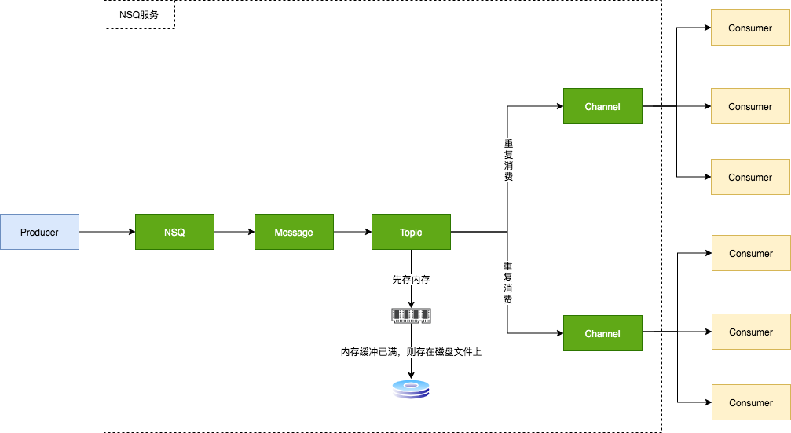

## NSQ

**[NSQ](https://github.com/nsqio/nsq)** is a realtime distributed messaging platform designed to operate at scale, handling
billions of messages per day.

## 说明

[NSQ v1.2.0](https://github.com/nsqio/nsq/tree/v1.2.0) 源码，仅为研究学习用

## 笔记



### nsq入口

```go
// apps/nsqd/main.go

svc.Run() ->  svc.Init() -> svc.Start()
```

### nsq执行
```go
opts := nsqd.NewOptions()
flagSet := nsqdFlagSet(opts)
flagSet.Parse(os.Args[1:])

var cfg config
configFile := flagSet.Lookup("config").Value.String()
_, err := toml.DecodeFile(configFile, &cfg)
// 合并命令行选项和配置文件内容，到opts中
options.Resolve(opts, flagSet, cfg)

nsqd, err := nsqd.New(opts)
// 加载Topic等信息，生成topic对象
err = p.nsqd.LoadMetadata()
// 持久化元信息
err = p.nsqd.PersistMetadata()

go func() {
    p.nsqd.Main()
}()

```

### nsqd.Main()核心代码

```go
func (n *NSQD) Main() error {
    ctx := &context{n}
    ...
    tcpServer := &tcpServer{ctx: ctx}
    n.waitGroup.Wrap(func() {
        exitFunc(protocol.TCPServer(n.tcpListener, tcpServer, n.logf))  // tcp服务
    })
    httpServer := newHTTPServer(ctx, false, n.getOpts().TLSRequired == TLSRequired)
    n.waitGroup.Wrap(func() {
        exitFunc(http_api.Serve(n.httpListener, httpServer, "HTTP", n.logf)) // http服务
    })
    if n.tlsConfig != nil && n.getOpts().HTTPSAddress != "" {
        httpsServer := newHTTPServer(ctx, true, true)
        n.waitGroup.Wrap(func() {
            exitFunc(http_api.Serve(n.httpsListener, httpsServer, "HTTPS", n.logf)) // https服务
        })
    }

    n.waitGroup.Wrap(n.queueScanLoop) // 队列循环服务
    n.waitGroup.Wrap(n.lookupLoop) // 节点信息管理服务
    if n.getOpts().StatsdAddress != "" {
        n.waitGroup.Wrap(n.statsdLoop) // 统计信息服务
    }
    ...
}
```

### http服务

```go
type httpServer struct {
	ctx         *context
	tlsEnabled  bool
	tlsRequired bool
	router      http.Handler
}

func newHTTPServer(ctx *context, tlsEnabled bool, tlsRequired bool) *httpServer {
    router := httprouter.New()
    s := &httpServer{
		ctx:         ctx,
		tlsEnabled:  tlsEnabled,
		tlsRequired: tlsRequired,
		router:      router,
    }
    ...
    // v1 negotiate
	router.Handle("POST", "/pub", http_api.Decorate(s.doPUB, http_api.V1)) // 消息发布
	router.Handle("POST", "/mpub", http_api.Decorate(s.doMPUB, http_api.V1)) // 消息批量发布
    router.Handle("GET", "/stats", http_api.Decorate(s.doStats, log, http_api.V1)) // 信息统计
    ...
    return s
}

// 中间件实现
type Decorator func(APIHandler) APIHandler

type APIHandler func(http.ResponseWriter, *http.Request, httprouter.Params) (interface{}, error)

func Decorate(f APIHandler, ds ...Decorator) httprouter.Handle { // ds即中间件
	decorated := f
	for _, decorate := range ds {
		decorated = decorate(decorated)
	}
	return func(w http.ResponseWriter, req *http.Request, ps httprouter.Params) {
		decorated(w, req, ps)
	}
}

func (s *httpServer) ServeHTTP(w http.ResponseWriter, req *http.Request) {
	s.router.ServeHTTP(w, req)
}

func (s *httpServer) doPUB(w http.ResponseWriter, req *http.Request, ps httprouter.Params) (interface{}, error) {
	// 限制消息长度
	if req.ContentLength > s.ctx.nsqd.getOpts().MaxMsgSize {
		return nil, http_api.Err{413, "MSG_TOO_BIG"}
	}

    // 使用LimiterReader读取请求体
    // LimiterReader会在返回内容末尾增加一个假的EOF，所以长度+1
	readMax := s.ctx.nsqd.getOpts().MaxMsgSize + 1 
	body, err := ioutil.ReadAll(io.LimitReader(req.Body, readMax)) // limit read

	reqParams, topic, err := s.getTopicFromQuery(req) // 
	var deferred time.Duration
    if ds, ok := reqParams["defer"]; ok { // defer参数单位毫秒，默认最大延迟队列时间为1h0m0s
        ...
    }
    // topic.GenerateID() 用于生成消息唯一ID，使用雪花算法实现
    // NewMessage 返回Message结构体
	msg := NewMessage(topic.GenerateID(), body)
	msg.deferred = deferred
    err = topic.PutMessage(msg) // topic.PutMessage调用put方法实现消息入队
    ...
}

type Message struct {
	ID        MessageID // 消息唯一ID
	Body      []byte // 消息体
	Timestamp int64 // 消息创建时间， 单位纳秒
	Attempts  uint16 // 消息出队次数，客户端可根据业务需求达到一定次数不在消费

	deliveryTS time.Time
	clientID   int64
	pri        int64
	index      int
	deferred   time.Duration // 延迟时间
}
func NewMessage(id MessageID, body []byte) *Message {
	return &Message{
		ID:        id,
		Body:      body,
		Timestamp: time.Now().UnixNano(),
	}
}

// topic.PutMessage调用put方法实现消息入队
func (t *Topic) put(m *Message) error {
	select {
	case t.memoryMsgChan <- m: // 先写入通道中，若通道写满，则写到磁盘中
	default:
		b := bufferPoolGet()
		err := writeMessageToBackend(b, m, t.backend)
		bufferPoolPut(b)
		t.ctx.nsqd.SetHealth(err)
		if err != nil {
			t.ctx.nsqd.logf(LOG_ERROR,
				"TOPIC(%s) ERROR: failed to write message to backend - %s",
				t.name, err)
			return err
		}
	}
	return nil
}

// 消息出队
// 遍历消息的消费者通道，依次将主题消息写入到通道中
// 
func (t *Topic) messagePump() {
	var msg *Message
	var chans []*Channel
	var memoryMsgChan chan *Message
	var backendChan chan []byte

	for {
		select {
		case <-t.channelUpdateChan:
			continue
		case <-t.pauseChan:
			continue
		case <-t.exitChan:
			goto exit
		case <-t.startChan:
		}
		break
	}
	t.RLock()
	for _, c := range t.channelMap { // 
		chans = append(chans, c)
	}
	t.RUnlock()
	if len(chans) > 0 && !t.IsPaused() {
		memoryMsgChan = t.memoryMsgChan
		backendChan = t.backend.ReadChan()
	}

	// main message loop
	for {
		select {
		case msg = <-memoryMsgChan:
		case buf = <-backendChan:
			msg, err = decodeMessage(buf) // msg来自内存和磁盘对应通道，通过select实现，其是无序的
			if err != nil {
				t.ctx.nsqd.logf(LOG_ERROR, "failed to decode message - %s", err)
				continue
			}
		case <-t.channelUpdateChan:
			chans = chans[:0]
			t.RLock()
			for _, c := range t.channelMap {
				chans = append(chans, c)
			}
			t.RUnlock()
			if len(chans) == 0 || t.IsPaused() {
				memoryMsgChan = nil
				backendChan = nil
			} else {
				memoryMsgChan = t.memoryMsgChan
				backendChan = t.backend.ReadChan()
			}
			continue
		case <-t.pauseChan:
			if len(chans) == 0 || t.IsPaused() {
				memoryMsgChan = nil
				backendChan = nil
			} else {
				memoryMsgChan = t.memoryMsgChan
				backendChan = t.backend.ReadChan()
			}
			continue
		case <-t.exitChan:
			goto exit
		}

		for i, channel := range chans {
			chanMsg := msg
			// copy the message because each channel
			// needs a unique instance but...
			// fastpath to avoid copy if its the first channel
			// (the topic already created the first copy)
			if i > 0 {
                chanMsg = NewMessage(msg.ID, msg.Body) // 每个消息通道会修改消息的Attempts，所以需要每个通道需要一个message副本
				chanMsg.Timestamp = msg.Timestamp
				chanMsg.deferred = msg.deferred
			}
			if chanMsg.deferred != 0 {
				channel.PutMessageDeferred(chanMsg, chanMsg.deferred) // 延迟消息
				continue
			}
			err := channel.PutMessage(chanMsg) // on-flight 消息
			if err != nil {
				t.ctx.nsqd.logf(LOG_ERROR,
					"TOPIC(%s) ERROR: failed to put msg(%s) to channel(%s) - %s",
					t.name, msg.ID, channel.name, err)
			}
		}
	}

exit:
	t.ctx.nsqd.logf(LOG_INFO, "TOPIC(%s): closing ... messagePump", t.name)
}


// memoryMsgChan是长度为opts.MemQueueSize的Message指针的通道
func NewTopic(topicName string, ctx *context, deleteCallback func(*Topic)) *Topic {
	t := &Topic{
        ...
        memoryMsgChan:     make(chan *Message, ctx.nsqd.getOpts().MemQueueSize),
        ...
	}
	return t
}
```

## nsq channel

```go
type Channel struct {
	// 64bit atomic vars need to be first for proper alignment on 32bit platforms
	requeueCount uint64
	messageCount uint64
	timeoutCount uint64

	sync.RWMutex

	topicName string
	name      string
	ctx       *context

	backend BackendQueue

	memoryMsgChan chan *Message
	exitFlag      int32
	exitMutex     sync.RWMutex

	// state tracking
	clients        map[int64]Consumer
	paused         int32
	ephemeral      bool
	deleteCallback func(*Channel)
	deleter        sync.Once

	// Stats tracking
	e2eProcessingLatencyStream *quantile.Quantile

	// TODO: these can be DRYd up
	deferredMessages map[MessageID]*pqueue.Item
	deferredPQ       pqueue.PriorityQueue // 最小堆实现的延迟队列
	deferredMutex    sync.Mutex
	inFlightMessages map[MessageID]*Message // 字典存储飞行状态的消息，即未被消费确认的消息
	inFlightPQ       inFlightPqueue
	inFlightMutex    sync.Mutex
}

func NewChannel(topicName string, channelName string, ctx *context,
	deleteCallback func(*Channel)) *Channel {

	c := &Channel{
		topicName:      topicName,
		name:           channelName,
		memoryMsgChan:  make(chan *Message, ctx.nsqd.getOpts().MemQueueSize),
		clients:        make(map[int64]Consumer),
		deleteCallback: deleteCallback,
		ctx:            ctx,
	}
	if len(ctx.nsqd.getOpts().E2EProcessingLatencyPercentiles) > 0 {
		c.e2eProcessingLatencyStream = quantile.New(
			ctx.nsqd.getOpts().E2EProcessingLatencyWindowTime,
			ctx.nsqd.getOpts().E2EProcessingLatencyPercentiles,
		)
	}

	c.initPQ()

	if strings.HasSuffix(channelName, "#ephemeral") {
		c.ephemeral = true
		c.backend = newDummyBackendQueue()
	} else {
		// backend names, for uniqueness, automatically include the topic...
		backendName := getBackendName(topicName, channelName)
		c.backend = diskqueue.New(
			backendName,
			ctx.nsqd.getOpts().DataPath,
			ctx.nsqd.getOpts().MaxBytesPerFile,
			int32(minValidMsgLength),
			int32(ctx.nsqd.getOpts().MaxMsgSize)+minValidMsgLength,
			ctx.nsqd.getOpts().SyncEvery,
			ctx.nsqd.getOpts().SyncTimeout,
			dqLogf,
		)
	}
	return c
}

// channel.PutMessage
func (c *Channel) PutMessage(m *Message) error {
	err := c.put(m)
}

func (c *Channel) put(m *Message) error {
	select {
	case c.memoryMsgChan <- m:
	default:
		b := bufferPoolGet()
		err := writeMessageToBackend(b, m, c.backend)
		bufferPoolPut(b)
	}
	return nil
}

func (c *Channel) PutMessageDeferred(msg *Message, timeout time.Duration) {
	c.StartDeferredTimeout(msg, timeout)
}

func (c *Channel) StartDeferredTimeout(msg *Message, timeout time.Duration) error {
	absTs := time.Now().Add(timeout).UnixNano()
	item := &pqueue.Item{Value: msg, Priority: absTs}
	err := c.pushDeferredMessage(item)
	if err != nil {
		return err
	}
	c.addToDeferredPQ(item)
	return nil
}

func (c *Channel) pushDeferredMessage(item *pqueue.Item) error {
	c.deferredMutex.Lock()
	// TODO: these map lookups are costly
	id := item.Value.(*Message).ID
	_, ok := c.deferredMessages[id]
	if ok {
		c.deferredMutex.Unlock()
		return errors.New("ID already deferred")
	}
	c.deferredMessages[id] = item
	c.deferredMutex.Unlock()
	return nil
}

func (c *Channel) addToDeferredPQ(item *pqueue.Item) {
	heap.Push(&c.deferredPQ, item) // 基于最小堆实现的优先队列
}
```